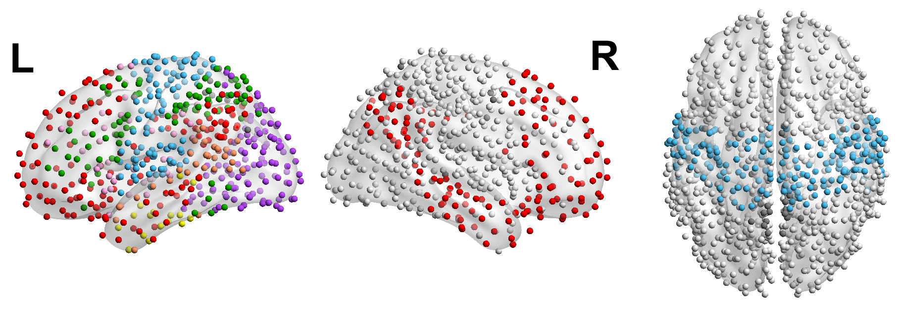

# Introductory programming tutorial for brain networks
This is a repository of some functions and code I used frequently while working in Emma Towlson's Network Neuroscience lab. I also included links/references to other resources that I've had to use during my master's research project. I hope this will act as a landing point for others to easily get resources/help. The target audience are beginner research students joining the lab and starting to work with brain network data. 

The initial idea was to have a example/demo notebook to go through how to read in some brain network data, create a network object, and compute some network metrics about the graph. Sadly I realized it is hard to do that because the brain data I have is confidential, so I cannot upload them to the internet willy nilly. If you're reading this because you're a new student that just joined our lab, you'll probably have your own brain data in the format of some .xlsx file or .mat file (MATLAB file). Start by checking out the data_io.py Python file that includes some functions on how you can read those files and create a NetworkX graph object (this is your brain network!)  

### Input / output (data_io.py)
- [X] Functions for reading in excel data of brain scans or MATLAB data
- [X] Exporting brain connectome in BrainNet Viewer format (.node and .edge files)
If your audience is from the network science community, BrainNet Viewer is a good visualization tool to show information about your network. You would be looking to get some images like the following: 

- [ ] Visualizing brain connectome in FSLEyes
If your audience is from neuroscience/biology background, BrainNet Viewer really confuses them. Instead I recommend using FSLEyes. Many of them might already use FSLeyes or something similar in their lab. You would get images like this if you use FSLEyes: 
<-- need to upload some images here -->
FSLEyes is a bit more confusing to use because there's two ways you can produce an image. I need to figure out how I can explain it in a notebook... (WIP)

### Brain connectomes (WIP - brain_network.py)
- [X] Function for averaging brain connectomes
- [ ] Function for getting basic network statistics (WIP)

### Resources/References 
* [Brain Connectivity Toolbox (Python)](https://pypi.org/project/bctpy/)
* [Community Louvain 2021 - MATLAB](https://drive.google.com/drive/folders/1P32DAUy1AFEn7biMomD0v8j373byRAOq)
* [ARC Cluster Guide](https://github.com/mariamasoliver/connect_to_ARC) by Maria Masoliver and Thomas Newton. 
	- If the software you need isn't available in the modules you can email:
support@hpc.ucalgary.ca and they can help get it installed.
	- You may also be able to install it on your own home directory if the source code is all in python. Self-install by uploading all the source code to your ARC account, usually in the same folder that the calling code is located. 
	- The [Compute Canada wiki](https://docs.computecanada.ca/wiki/Installing_software_in_your_home_directory) has some info on installing software that might be useful.
	- [Apply for ARC](https://rcs.ucalgary.ca/How_to_get_an_account)
* [VPN UoC](https://iac01.ucalgary.ca/SDSWeb/LandingPage.aspx?ReturnUrl=%2fSDSWeb%2fdefault.aspx)
