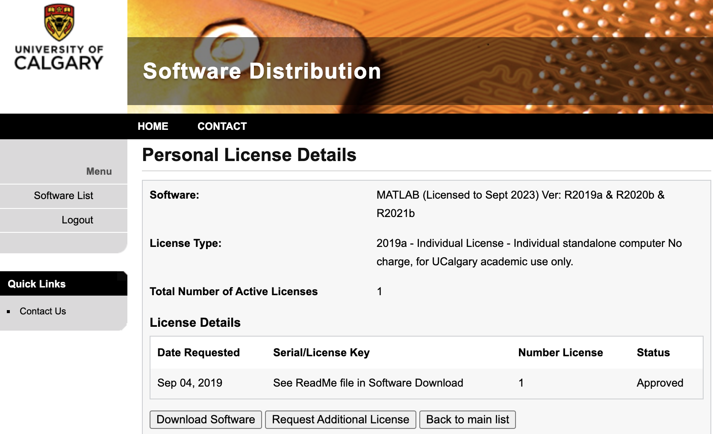

# Installing BrainNet Viewer Application
*Strongly* recommend using the MATLAB version instead of the Standalone version.

1. Get a free MATLAB license through your university. If you're from UoC, you can go [here](https://iac01.ucalgary.ca/SDSWeb/LandingPage.aspx?ReturnUrl=%2fSDSWeb%2fdefault.aspx).

2. Download [BrainNet Viewer](https://www.nitrc.org/projects/bnv). (The MATLAB version is called "matlab code")
3. Whatever you unzip, drag all the folders into your MATLAB folder.
(You should have a MATLAB folder which is your default path setting for MATLAB when it starts.)

Open MATLAB. Look at the left most panel. It should be called "Current Folder" and you should see a list of folders.
These are all the folders you've added under your MATLAB folder. You should see "BrainNet Viewer" listed in here.
Right-click on the BrainNet Viewer folder and select "Add to Path > Folders and Subfolders".
This allows MATLAB to have access to files within these folders. When it is accessible, you should see
the folder name be solid black instead of grey on the left side of your MATLAB window.

In the middle/bottom of your MATLAB you should find the "Command Window" panel.
Type in: BrainNet
Press Enter.
You should see the BrainNet Viewer Application pop up.

Click on the load file icon. You'll see 4 possible input files:
1. Surface file - Click Browse and navigate to "SurfTemplate" folder and select some surface file. I like to use BrainMesh_ICBM152_smoothed.nv
2. node file - Click Browse and navigate to your .node file. See below for how to make this.
3. edge file - Click Browse and navigate to your .edge file. Optional. Leave it blank if you don't need edges.
4. mapping file - ignore

Go next, and the BrainNet Option window should automatically appear. 

Check out the brainnet_viewer_tutorial notebook to create files for BrainNet Viewer. 

# Viewing the .node in BrainNet Viewer Application

Load the .node file into BrainNet Viewer. 

Go to the Node tab under Options.

### Label Option
- Default is Label None. Click Label to display node names. Use the font button to adjust font.
- If you have a lot of nodes, this is usually terrible. You can use the "Above Threshold" to display certain node names.
It'll take a few practices to figure out how you can use this feature.

### Size Option
- Adjusts size of nodes. It can be a scaled factor of what you stored in the .node file.
- With "auto" size, your nodes might be too big. I recommend selecting "Equal" (assuming your node sizes are fixed) and
set the value to 1. If your node sizes are suppose to change, select "Value" and use "raw" option. This will take the
size value in your .node file and use that as size. A good range is around 1 - 4.

### Color Option
- Default is "Same", all nodes are the same color.
- Select "Modular". Click "More".
Now you should see you have X number of modules. This corresponds to the integer values you picked for your colors.
The modules are named according to your integer values. For example, I see "Module0" and "Module1" because I had color
values 0 and 1. Now I select Module0 to be grey, and Module1 to be red.

Once you're done with your options. Click *Apply* and **wait**... **Keep waiting**.

Along the top of BrainNet Viewer, you'll see some icons lie Zoom in, Zoom out, a hand, and this cube with an arrow.
**Click the cube with the arrow**. Now click the brain and move your mouse. You should see a 3D glass brain with nodes
suspended in it and you can rotate to view at different angles.

